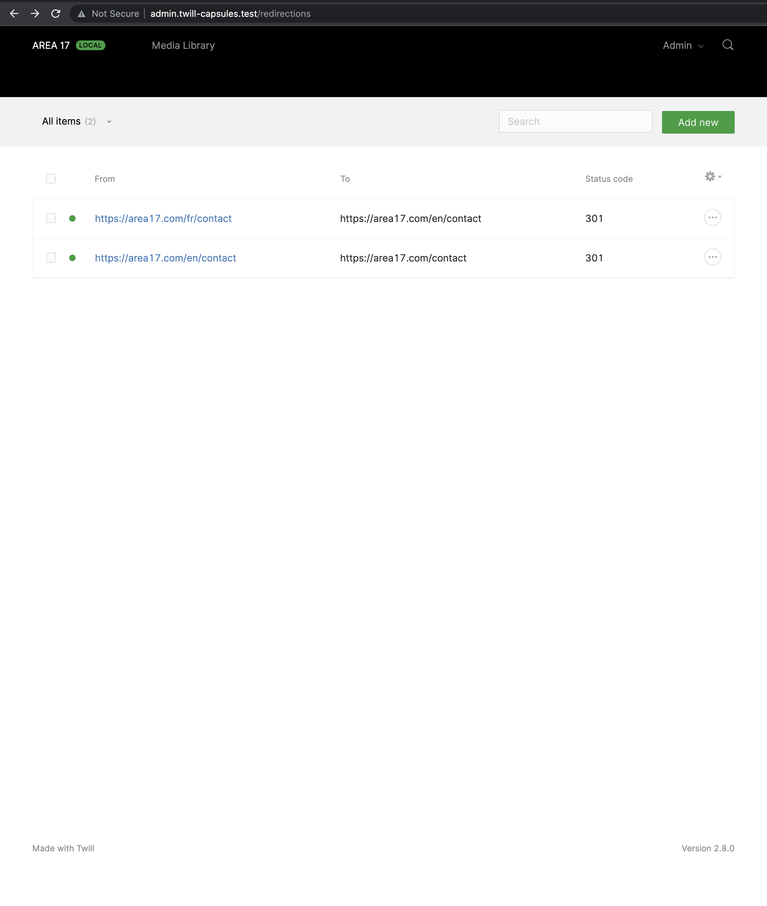

# Redirections
## Twill Capsule

### Description

This Capsule allows you to allow your users to setup their own redirections.




## Installing

### Clone the repository inside your app/Twill/Capsules folder. 

```
cd app/Twill/Capsules
git clone https://github.com/area17/twill-capsule-redirections.git
mv twill-capsule-redirections Redirections
```

### Enable the Capsule in config/twill.php:

``` php
    'capsules' => [
        'list' => [
            [
                'name' => 'Redirections',
                'enabled' => true,
            ],
            ...
```

### Import the redirector middleware:

``` php
<?php

namespace App\Http;

use Illuminate\Foundation\Http\Kernel as HttpKernel;

class Kernel extends HttpKernel
{
    /**
     * The application's global HTTP middleware stack.
     *
     * This middleware is run during every request to your application.
     *
     * @var array
     */
    protected $middleware = [
        \App\Twill\Capsules\Redirections\Http\Middleware\Redirector::class,
        ...
    ];
}
```

## Using

Once installed and configured, you can go to https://your-admin-url/redirections to manage redirections.
